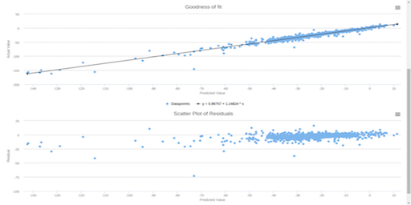

# DynaML: ML + JVM + Scala


[](https://gitter.im/DynaML/Lobby?utm_source=badge&utm_medium=badge&utm_campaign=pr-badge&utm_content=badge) [](https://travis-ci.org/transcendent-ai-labs/DynaML) [](https://jitpack.io/#transcendent-ai-labs/DynaML)
[](https://codecov.io/gh/transcendent-ai-labs/DynaML)
[](http://joss.theoj.org/papers/a561bdd3e960c5b0718c67c3f73c6f3b)

------------------

<br/>

DynaML is a Scala & JVM Machine Learning toolbox for research, education & industry.

<br/>

<table>
    <tr>
        <th>  </th> 
        <th>  </th>
    </tr>
</table>


------------------

## Motivation


 - __Interactive__ Don't want to create Maven/sbt project skeletons
 every time you want to try out ideas? Create and execute [scala worksheets](scripts/randomvariables.sc) 
 in the DynaML shell. DynaML comes packaged with a customized version of the [Ammonite](http://ammonite.io) REPL, 
 with *auto-complete*, file operations and scripting capabilities.  
 
 - __End to End__ Create complex pre-processing pipelines with the [data pipes](https://transcendent-ai-labs.github.io/DynaML/pipes/pipes/) API, 
 train models ([deep nets](scripts/cifar.sc), [gaussian processes](https://transcendent-ai-labs.github.io/DynaML/core/core_gp/), 
 [linear models](https://transcendent-ai-labs.github.io/DynaML/core/core_glm/) and more), 
 optimize over [hyper-parameters](https://transcendent-ai-labs.github.io/DynaML/core/core_opt_global/), 
 [evaluate](https://transcendent-ai-labs.github.io/DynaML/core/core_model_evaluation/) model predictions and 
 [visualise](https://transcendent-ai-labs.github.io/DynaML/core/core_graphics/) results.
 
 - __Enterprise Friendly__ Take advantage of the JVM and Scala ecosystem, use Apache [Spark](https://spark.apache.org) 
 to write scalable data analysis jobs, [Tensorflow](http://tensorflow.org) for deep learning, all in the same toolbox.

------------------

## Getting Started

### Platform Compatibility

Currently, only *nix and OSX platforms are supported.

DynaML is compatible with Scala `2.11`

### Installation

Easiest way to install DynaML is cloning & compiling from the [github](/) repository. Please take a look at 
the [installation](https://transcendent-ai-labs.github.io/DynaML/installation/installation/) instructions in the 
[user guide](https://transcendent-ai-labs.github.io/DynaML/).

------------------

## CIFAR in 100 lines

Below is a sample [script](scripts/cifar.sc) where we train a neural network of stacked 
[Inception](https://arxiv.org/pdf/1409.4842.pdf) cells on the [CIFAR-10](https://en.wikipedia.org/wiki/CIFAR-10)
image classification task.

```scala
import ammonite.ops._
import io.github.mandar2812.dynaml.pipes.DataPipe
import io.github.mandar2812.dynaml.tensorflow.data.AbstractDataSet
import io.github.mandar2812.dynaml.tensorflow.{dtflearn, dtfutils}
import io.github.mandar2812.dynaml.tensorflow.implicits._
import org.platanios.tensorflow.api._
import org.platanios.tensorflow.api.learn.layers.Activation
import org.platanios.tensorflow.data.image.CIFARLoader
import java.nio.file.Paths


val tempdir = home/"tmp"

val dataSet = CIFARLoader.load(
  Paths.get(tempdir.toString()), 
  CIFARLoader.CIFAR_10)

val tf_dataset = AbstractDataSet(
  dataSet.trainImages, dataSet.trainLabels, dataSet.trainLabels.shape(0),
  dataSet.testImages, dataSet.testLabels, dataSet.testLabels.shape(0))

val trainData =
  tf_dataset.training_data
    .repeat()
    .shuffle(10000)
    .batch(128)
    .prefetch(10)


println("Building the model.")
val input = tf.learn.Input(
  UINT8, 
  Shape(
    -1, 
    dataSet.trainImages.shape(1), 
    dataSet.trainImages.shape(2), 
    dataSet.trainImages.shape(3))
)

val trainInput = tf.learn.Input(UINT8, Shape(-1))

val relu_act = DataPipe[String, Activation](tf.learn.ReLU(_))

val architecture = tf.learn.Cast("Input/Cast", FLOAT32) >>
  dtflearn.inception_unit(
    channels = 3,  Seq.fill(4)(10), 
    relu_act)(layer_index = 1) >>
  dtflearn.inception_unit(
    channels = 40, Seq.fill(4)(5), 
    relu_act)(layer_index = 2) >>
  tf.learn.Flatten("Layer_3/Flatten") >>
  dtflearn.feedforward(256)(id = 4) >>
  tf.learn.ReLU("Layer_4/ReLU", 0.1f) >>
  dtflearn.feedforward(10)(id = 5)

val trainingInputLayer = tf.learn.Cast("TrainInput/Cast", INT64)

val loss = 
  tf.learn.SparseSoftmaxCrossEntropy("Loss/CrossEntropy") >> 
    tf.learn.Mean("Loss/Mean") >> 
    tf.learn.ScalarSummary("Loss/Summary", "Loss")

val optimizer = tf.train.Adam(0.1)

val summariesDir = Paths.get((tempdir/"cifar_summaries").toString())

val (model, estimator) = dtflearn.build_tf_model(
  architecture, input, trainInput, trainingInputLayer,
  loss, optimizer, summariesDir, dtflearn.max_iter_stop(500),
  100, 100, 100)(
  trainData, true)

def accuracy(predictions: Tensor, labels: Tensor): Float =
  predictions.argmax(1)
    .cast(UINT8)
    .equal(labels)
    .cast(FLOAT32)
    .mean()
    .scalar
    .asInstanceOf[Float]

val (trainingPreds, testPreds): (Option[Tensor], Option[Tensor]) =
  dtfutils.predict_data[
    Tensor, Output, DataType, Shape, Output,
    Tensor, Output, DataType, Shape, Output,
    Tensor, Tensor](
    estimator,
    data = tf_dataset,
    pred_flags = (true, true),
    buff_size = 20000)

val (trainAccuracy, testAccuracy) = (
  accuracy(trainingPreds.get, dataSet.trainLabels),
  accuracy(testPreds.get, dataSet.testLabels))

print("Train accuracy = ")
pprint.pprintln(trainAccuracy)

print("Test accuracy = ")
pprint.pprintln(testAccuracy)
```

------------------


## Support & Community

 - [User guide](https://transcendent-ai-labs.github.io/DynaML/)
 - [Gitter](https://gitter.im/DynaML/Lobby?utm_source=badge&utm_medium=badge&utm_campaign=pr-badge&utm_content=badge)
 - [Contributing](https://github.com/transcendent-ai-labs/DynaML/blob/master/CONTRIBUTING.md)
 - [Code of Conduct](https://github.com/transcendent-ai-labs/DynaML/blob/master/CODE_OF_CONDUCT.md)
