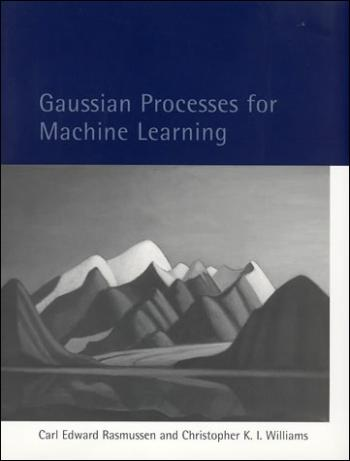

<br/>
_Gaussian Processes_ are stochastic processes whose finite dimensional distributions are multivariate gaussians.

_Gaussian Processes_ are powerful non-parametric predictive models, which represent probability measures over spaces of functions. [Ramussen and Williams](https://books.google.nl/books/about/Gaussian_Processes_for_Machine_Learning.html?id=vWtwQgAACAAJ&hl=en) is the definitive guide on understanding their applications in machine learning and a gateway to their deeper theoretical foundations.



<br/>

_Gaussian Process_ models are well supported in DynaML, the [`#!scala AbstractGPRegressionModel[T, I]`](https://transcendent-ai-labs.github.io/api_docs/DynaML/recent/dynaml-core/index.html#io.github.mandar2812.dynaml.models.gp.AbstractGPRegressionModel) and [`#!scala AbstractGPClassification[T, I]`](https://transcendent-ai-labs.github.io/api_docs/DynaML/recent/dynaml-core/index.html#io.github.mandar2812.dynaml.models.gp.AbstractGPClassification) classes which extend the [`#!scala StochasticProcessModel[T, I, Y, W]`](https://transcendent-ai-labs.github.io/api_docs/DynaML/recent/dynaml-core/index.html#io.github.mandar2812.dynaml.models.StochasticProcessModel) base trait are the starting point for all GP implementations.


## Gaussian Process Regression

The GP regression framework aims to infer an unknown function $f(x)$ given $y_i$ which are noise corrupted observations of this unknown function. This is done by adopting an explicit probabilistic formulation to the multi-variate distribution of the noise corrupted observations $y_i$ conditioned on the input features (or design matrix) $X$

$$
\begin{align}
		& y = f(x) + \epsilon \\
		& f \sim \mathcal{GP}(m(x), C(x,x')) \\
		& \left(\mathbf{y} \ \ \mathbf{f_*} \right)^T | X \sim \mathcal{N}\left(\mathbf{0}, \left[ \begin{matrix} K(X, X) + \sigma^{2} \it{I} & K(X, X_*) \\ K(X_*, X) & K(X_*, X_*) \end{matrix} \right ] \right)
\end{align}
$$


In the presence of training data

$$
X = (x_1, x_2, \cdot , x_n) \ \mathbf{y} = (y_1, y_2, \cdot , y_n)
$$

Inference is carried out by calculating the posterior predictive distribution over the unknown targets $\mathbf{f_*}|X,\mathbf{y},X_*$ assuming $X_*$, the test inputs are known.

$$
\begin{align}
		& \mathbf{f_*}|X,\mathbf{y},X_* \sim \mathcal{N}(\mathbf{\bar{f_*}}, cov(\mathbf{f_*}))  \label{eq:posterior}\\
		& \mathbf{\bar{f_*}} \overset{\triangle}{=} \mathbb{E}[\mathbf{f_*}|X,y,X_*] = K(X_*,X)[K(X,X) + \sigma^{2}_n \it{I}]^{-1} \mathbf{y} \label{eq:posterior:mean} \\
		& cov(\mathbf{f_*}) = K(X_*,X_*) - K(X_*,X)[K(X,X) + \sigma^{2}_n \it{I}]^{-1}K(X,X_*)
\end{align}
$$

### GP models for a single output

For univariate GP models (single output), use the [`#!scala GPRegression`](https://transcendent-ai-labs.github.io/api_docs/DynaML/recent/dynaml-core/index.html#io.github.mandar2812.dynaml.models.gp.GPRegression) class (an extension of `#!scala AbstractGPRegressionModel`). To construct a GP regression model you would need:

* Training data
* Kernel/covariance instance to model correlation between values of the latent function at each pair of input features.
* Kernel instance to model the correlation of the additive noise, generally the `#!scala DiracKernel` (white noise) is used.

```scala
val trainingdata: Stream[(DenseVector[Double], Double)] = ...
val num_features = trainingdata.head._1.length

// Create an implicit vector field for the creation of the stationary
// radial basis function kernel
implicit val field = VectorField(num_features)

val kernel = new RBFKernel(2.5)
val noiseKernel = new DiracKernel(1.5)
val model = new GPRegression(kernel, noiseKernel, trainingData)
```

### GP models for multiple outputs

As reviewed in [Lawrence et.al](https://arxiv.org/abs/1106.6251), Gaussian Processes for multiple outputs can be interpreted as single output GP models with an expanded index set. Recall that GPs are stochastic processes and thus are defined on some _index set_, for example in the equations above it is noted that $x \in \mathbb{R}^p$ making $\mathbb{R}^p$ the _index set_ of the process.

In case of multiple outputs the index set is expressed as a cartesian product $x \in \mathbb{R}^{p} \times \{1,2, \cdots, d \}$, where $d$ is the number of outputs to be modeled.

It needs to be noted that now we will also have to define the kernel function on the same index set i.e. $\mathbb{R}^{p} \times \{1,2, \cdots, d \}$.

In multi-output GP literature a common way to construct kernels on such index sets is to multiply base kernels on each of the parts $\mathbb{R}^p$ and $\{1,2,\cdots,d\}$, such kernels are known as _separable kernels_.

$$
\begin{equation}
K((\mathbf{x}, d), (\mathbf{x}', d')) = K_{x}(\mathbf{x}, \mathbf{x}') . K_{d}(d, d')
\end{equation}
$$

Taking this idea further _sum of separable kernels_ (SoS) are often employed in multi-output GP models. These models are also known as _Linear Models of Co-Regionalization_ (LMC) and the kernels which encode correlation between the outputs $K_d(.,.)$ are known as _co-regionalization kernels_.

$$
\begin{equation}
K((\mathbf{x}, d), (\mathbf{x}', d')) = \sum_{i = 1}^{D} K^{i}_{x}(\mathbf{x}, \mathbf{x}') . K^{i}_{d}(d, d')
\end{equation}
$$

!!! tip "Creating separable kernels"
		Creating SoS kernels in DynaML is quite straightforward, use the `#!scala :*` operator to multiply a kernel defined on `#!scala DenseVector[Double]` with a kernel defined on `#!scala Int`.

		```scala
		val linearK = new PolynomialKernel(2, 1.0)
		val tKernel = new TStudentKernel(0.2)
		val d = new DiracKernel(0.037)

		val mixedEffects = new MixedEffectRegularizer(0.5)
		val coRegCauchyMatrix = new CoRegCauchyKernel(10.0)
		val coRegDiracMatrix = new CoRegDiracKernel

		val sos_kernel: CompositeCovariance[(DenseVector[Double], Int)] =
			(linearK :* mixedEffects)  + (tKernel :* coRegCauchyMatrix)

		val sos_noise: CompositeCovariance[(DenseVector[Double], Int)] =
			d :* coRegDiracMatrix

		```

!!! tip

		You can use the [`#!scala MOGPRegressionModel[I]`](https://transcendent-ai-labs.github.io/api_docs/DynaML/recent/dynaml-core/index.html#io.github.mandar2812.dynaml.models.gp.MOGPRegressionModel) class to create multi-output GP models.

		```scala
		val trainingdata: Stream[(DenseVector[Double], DenseVector[Double])] = _

		val model = new MOGPRegressionModel[DenseVector[Double]](
			sos_kernel, sos_noise, trainingdata,
			trainingdata.length,
			trainingdata.head._2.length)

		```

<br/>

## Gaussian Process Binary Classification

Gaussian process models for classification are formulated using two components.

- A latent (nuisance) function $f(x)$
- A transfer function $\sigma(.)$ which transforms the value $f(x)$ to a class probability

$$
	\begin{align}
		& \pi(x) \overset{\triangle}{=} p(y = +1| x) = \sigma(f(x)) \\
		& f \sim \mathcal{GP}(m(x), C(x,x')) \\
	\end{align}
$$

Inference is divided into two steps.

- Computing the distribution of the latent function corresponding to a test case

$$
\begin{align}
	& p(f_*|X, \mathbf{y}, x_*) = \int p(f_*|X, \mathbf{y}, x_*, \mathbf{f}) p(\mathbf{f}|X, \mathbf{y}) d\mathbf{f} \\
	& p(\mathbf{f}|X, \mathbf{y}) = p(\mathbf{y}| \mathbf{f}) p(\mathbf{f}|X)/ p(\mathbf{y}|X)
\end{align}
$$

- Generating probabilistic prediction for a test case.

$$
\bar{\pi_*} \overset{\triangle}{=} p(y_* = +1| X, \mathbf{y}, x_*) = \int \sigma(f_*) p(f_*|X, \mathbf{y}, x_*) df_*
$$

```scala
val trainingdata: Stream[(DenseVector[Double], Double)] = ...
val num_features = trainingdata.head._1.length

// Create an implicit vector field for the creation of the stationary
// radial basis function kernel
implicit val field = VectorField(num_features)

val kernel = new RBFKernel(2.5)
val likelihood = new VectorIIDSigmoid()
val model = new LaplaceBinaryGPC(trainingData, kernel, likelihood)
```

## Extending The GP Class

In case you want to customize the implementation of _Gaussian Process_ models in DynaML, you can do so by extending the GP abstract skeleton ```GaussianProcessModel``` and using your own data structures for the type parameters `I` and `T`.

```scala
import breeze.linalg._
import io.github.mandar2812.dynaml.pipes._
import io.github.mandar2812.dynaml.probability._
import io.github.mandar2812.dynaml.models.gp._
import io.github.mandar2812.dynaml.kernels._
 
 
class MyGPRegressionModel[T, I](
  cov: LocalScalarKernel[I],
  n: LocalScalarKernel[I],
  data: T, num: Int, mean: DataPipe[I, Double]) extends 
  AbstractGPRegressionModel[T, I](cov, n, data, num, mean) {

  override val covariance = cov

  override val noiseModel = n

  override protected val g: T = data

  /**
    * Convert from the underlying data structure to
    * Seq[(I, Y)] where I is the index set of the GP
    * and Y is the value/label type.
    **/
  override def dataAsSeq(data: T): Seq[(I, Double)] = ???


  /**
    * Calculates the energy of the configuration,
    * in most global optimization algorithms
    * we aim to find an approximate value of
    * the hyper-parameters such that this function
    * is minimized.
    *
    * @param h The value of the hyper-parameters in 
    *          the configuration space
    * @param options Optional parameters
    *                
    * @return Configuration Energy E(h)
    *
    * In this particular case E(h) = -log p(Y|X,h)
    * also known as log likelihood.
    **/
  override def energy(
    h: Map[String, Double], 
    options: Map[String, String]): Double = ???

  /**
    * Calculates the gradient energy of the configuration and
    * subtracts this from the current value of h to yield a new
    * hyper-parameter configuration.
    *
    * Over ride this function if you aim to implement a 
    * gradient based hyper-parameter optimization routine 
    * like ML-II
    *
    * @param h The value of the hyper-parameters in the 
    *          configuration space
    * @return Gradient of the objective function 
    *         (marginal likelihood) as a Map
    **/
  override def gradEnergy(
    h: Map[String, Double]): Map[String, Double] = ???

  /**
   * Calculates posterior predictive distribution for
   * a particular set of test data points.
   *
   * @param test A Sequence or Sequence like data structure
   *             storing the values of the input patters.
   **/
  override def predictiveDistribution[U <: Seq[I]](
    test: U): MultGaussianPRV = ???

 //Use the predictive distribution to generate a point prediction
 override def predict(point: I): Double = ???
}

```